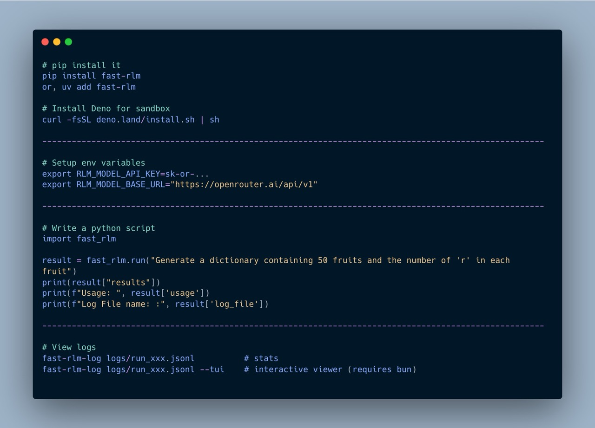
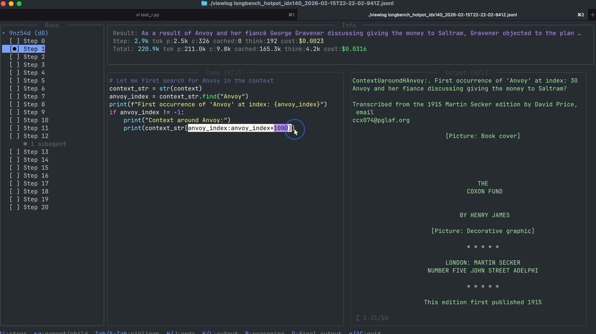

# fast-rlm

[](https://pypi.org/project/fast-rlm/)
[](https://github.com/avbiswas/fast-rlm)
[](https://avbiswas.github.io/fast-rlm/)

A minimal implementation of Recursive Language Models (RLMs) using Deno and Pyodide.

[GitHub](https://github.com/avbiswas/fast-rlm) | [Documentation](https://avbiswas.github.io/fast-rlm/) | [PyPI](https://pypi.org/project/fast-rlm/)

> **Watch the full video on YouTube**
> **[RLM Tutorial](https://youtu.be/nxaVvvrezbY)**

## What are RLMs

RLMs are an inference technique where an LLM interacts with arbitrarily long prompts through an external REPL. The LLM can write code to explore, decompose, and transform the prompt. It can recursively invoke sub-agents to complete smaller subtasks. Crucially, sub-agent responses are not automatically loaded into the parent agent's context — they are returned as symbols or variables inside the parent's REPL.

## Support

If you find this helpful, consider supporting on Patreon — it hosts all code, projects, slides, and write-ups from the YouTube channel.

[](https://www.patreon.com/NeuralBreakdownwithAVB)

---

## Demo

<video src="https://github.com/user-attachments/assets/fcaeab69-e384-4b26-8d6a-b71c1464e7f2" controls width="100%"></video>

---

## Install

```bash
pip install fast-rlm
```

### Requirements

- Python 3.10+
- [Deno](https://deno.land/) 2+
  - macOS/Linux: `curl -fsSL https://deno.land/install.sh | sh`
  - Windows (npm): `npm install -g deno`
- (Optional) [Bun](https://bun.sh/) — only needed for the TUI log viewer

### Environment Variables

Set your LLM API key before running:

```bash
export RLM_MODEL_API_KEY=sk-or-...
```

| Variable | Description | Default |
|----------|-------------|---------|
| `RLM_MODEL_API_KEY` | API key for your LLM provider | — |
| `RLM_MODEL_BASE_URL` | OpenAI-compatible base URL | `https://openrouter.ai/api/v1` |
| `GOOGLE_CLOUD_PROJECT` | GCP project ID (Vertex AI only) | — |
| `GOOGLE_CLOUD_LOCATION` | GCP region (Vertex AI only) | `us-central1` |

By default, fast-rlm uses [OpenRouter](https://openrouter.ai). You can point it at any OpenAI-compatible API by setting `RLM_MODEL_BASE_URL`.

### Vertex AI (Google Gemini)

Use Gemini models via Vertex AI with IAM-based auth (no API key needed):

```python
import fast_rlm

config = fast_rlm.RLMConfig()
config.primary_agent = "vertex/google/gemini-2.5-flash"
config.sub_agent = "vertex/google/gemini-2.5-flash"

result = fast_rlm.run("Count the r's in 50 fruits", config=config, vertex=True)
```

Auth uses Application Default Credentials. Either run `gcloud auth application-default login` or set `GOOGLE_APPLICATION_CREDENTIALS` to a service account key path.

---

## Quick Start



```python
import fast_rlm

result = fast_rlm.run("Generate 50 fruits and count number of r")
print(result["results"])
print(result["usage"])
```

## Arbitrarily Long Context

The key idea behind RLMs is that the prompt can be arbitrarily long — far beyond any model's context window. The agent explores it programmatically through the REPL rather than trying to fit it all into a single call.

```python
import fast_rlm

transcripts = open("lex_fridman_all_transcripts.txt").read()  # millions of tokens

result = fast_rlm.run(
    "Here are the transcripts of all Lex Fridman podcasts. "
    "Summarize what the first 5 Machine Learning guests had to say about AGI.\n\n"
    + transcripts
)
print(result["results"])
```

The agent will write code to search, filter, and chunk the transcripts on its own — no manual splitting required.

## Structured Input & Output

Instead of squeezing your data into a string, you can pass a `dict` as the query and ask for a typed result back via `output_schema`. The agent receives the dict as a real Python `dict` (no parsing on its first turn), and its `FINAL` value is validated against the schema before being returned.

```python
import fast_rlm
from pydantic import BaseModel

class Verdict(BaseModel):
    movie: str
    average_score: float
    consensus: str

result = fast_rlm.run(
    {
        "task": "Aggregate the reviews into a single verdict.",
        "movie": "The Trail of Pixels",
        "reviews": [
            {"name": "Asha", "score": 8, "text": "Tight pacing..."},
            {"name": "Bo",   "score": 6, "text": "Beautiful but thin..."},
            {"name": "Cy",   "score": 9, "text": "Instant favorite..."},
        ],
    },
    output_schema=Verdict,
)

verdict = Verdict.model_validate(result["results"])
```

**Structured input.** When `query` is a `dict`, the agent's initial probe prints a flat top-level schema (keys + type + length + truncated preview) so it can index `context["reviews"]` directly instead of stringifying.

**Structured output.** `output_schema` accepts:

| Form | Example |
|---|---|
| Pydantic model class | `output_schema=MyModel` |
| Pydantic generic | `output_schema=list[MyModel]` |
| Python primitive | `output_schema=int` (also `str`, `float`, `bool`, `list`, `dict`) |
| Raw JSON Schema dict | `output_schema={"type": "array", "items": {"type": "string"}}` |

The schema is shown to the agent at step 0 (`Required output schema for FINAL (JSON Schema):`). After every `FINAL(...)` call the value is validated; on failure the agent receives the schema and the specific validation errors (path + message) and may retry within its remaining call budget. Pydantic is an *optional* dependency — only required if you pass a Pydantic class or generic.

**Schemas for subagents.** Inside the REPL the agent can require a subagent's output shape by passing a JSON Schema dict as the second argument to `llm_query`:

```repl
schema = {"type": "array", "items": {"type": "string"}}
fruits = await llm_query("Generate 25 fruit names.", schema)
```

The child subagent enforces the schema the same way. See [`examples/structured_io.py`](examples/structured_io.py) and [`examples/parallel_r_count.py`](examples/parallel_r_count.py) for end-to-end demos.

## Tools

Inside the REPL the agent has two built-in tools and may also receive user-defined tools as ordinary Python functions. There is no separate tool-calling API — tools are just callables in the REPL namespace.

Pass Python functions to `fast_rlm.run(..., tools=[my_fn])` and they will be pre-loaded into the root agent's REPL. The RLM is shown the function name, input names, and docstring as description. They are not shown the full internal code of the tool (although they can choose to inspect it if the task requires them to). The agent calls them like any normal function inside the REPL.

```python
def filter_short(items: list[str], max_len: int = 20) -> list[str]:
    """Return only items shorter than max_len."""
    return [x for x in items if len(x) < max_len]

result = fast_rlm.run("Pick the short titles from the list.", tools=[filter_short])
```

Two rules apply to any tool that may be handed to a sub-agent:

- **Sub-agents do NOT inherit tools automatically.** To give a child a tool, the main agent must pass it explicitly in the REPL: `await llm_query("...", tools=[filter_short])`.
- **Tools must be self-contained.** Do imports *inside* the function body and don't close over REPL-level variables - the child runs in a fresh REPL where outer state does not exist.

The agent can also `def` new functions inside the REPL at any time and pass them down the same way.

Currently all tools are expected to be Python functions. These functions are available inside the REPL. They are NOT available when the LLM produces code or generates reasoning steps.

## Passing environment variables inside the REPL

Tools often need credentials or configuration (API keys, base URLs, account IDs). Pass them through the `env_variables` kwarg on `fast_rlm.run(...)`:


```python
import os
import fast_rlm

def search_web(query: str, top_k: int = 5) -> list[dict]:
    """Search the web via Tavily and return the top results."""
    import os, urllib.request, json
    req = urllib.request.Request(
        "https://api.tavily.com/search",
        data=json.dumps({"query": query, "max_results": top_k}).encode(),
        headers={
            "Authorization": f"Bearer {os.environ['TAVILY_API_KEY']}",
            "Content-Type": "application/json",
        },
    )
    return json.loads(urllib.request.urlopen(req).read())["results"]

result = fast_rlm.run(
    "Find three recent papers on recursive language models.",
    tools=[search_web],
    env_variables={"TAVILY_API_KEY": os.environ["TAVILY_API_KEY"]},
)
```

Behavior:

- `env_variables` must be a `dict[str, str]`.
- Each entry is injected into `os.environ` inside **every** Pyodide REPL spawned by the run — the root agent and all sub-agents.
- They are **not** set on the host Deno process and never appear in prompts, logs, or model context. The model only ever sees a tool's signature + docstring, so the key stays hidden as long as your tool doesn't print or return it.
- Tools read them with the normal `os.environ["..."]` (do the `import os` inside the tool body — see the self-containment rule above).


## MCP servers

fast-rlm can connect to [Model Context Protocol](https://modelcontextprotocol.io) servers and expose their tools and resources inside the REPL. The agent calls them with `await mcp_call(server, tool, **kwargs)` and reads resources with `await mcp_read_resource(uri)` — just like any other REPL function.

**Nothing extra to install for fast-rlm.** MCP support is optional and lazy: the MCP client lives in the Deno engine, and Deno auto-downloads it on first use. There is *no* `pip install fast-rlm[mcp]` — runs that don't use MCP never load it. You only install the **MCP servers** you actually want to connect to (each per its own docs).

Pass servers to `run(..., mcp_servers={...})`, keyed by name. Transport is chosen by the config shape:

```python
import fast_rlm

result = fast_rlm.run(
    "Read /data/report.md and summarize it in three bullets.",
    mcp_servers={
        # stdio: fast-rlm SPAWNS the server (and kills it on exit) — you don't run it.
        "fs":   {"command": "npx", "args": ["-y", "@modelcontextprotocol/server-filesystem", "/data"]},
        # http: the server must already be running; you point at its URL.
        "web":  {"url": "http://localhost:3333/mcp", "headers": {"Authorization": "Bearer ..."}},
    },
)
```

Install a server the usual way before pointing fast-rlm at it, e.g.:

```bash
# stdio servers are launched on demand via their command (npx/uvx/node/...)
npx -y @modelcontextprotocol/server-filesystem /data    # Node-based
uvx mcp-server-fetch                                     # Python-based
```

| Config key | Transport | Who runs the server? | Notes |
|---|---|---|---|
| `command` (+ `args`, `cwd`, `env`) | stdio | fast-rlm spawns it | grants Deno `--allow-run`; **a shell/filesystem server is full host access, not sandboxed** |
| `url` (+ `headers`) | HTTP | you (must be listening) | |

Inside the REPL the agent gets a small, lazy discovery API (the step-0 probe only shows counts, never full schemas):

- `mcp_list_tools(server=None)` / `mcp_tool_schema("server.tool")` / `await mcp_call(server, tool, **kwargs)`
- `mcp_list_resources()` / `mcp_list_resource_templates()` / `await mcp_read_resource(uri, server=None)`


## Configuration

```python
from fast_rlm import run, RLMConfig

config = RLMConfig.default()
config.primary_agent = "minimax/minimax-m2.5"
config.sub_agent = "minimax/minimax-m2.5"
config.max_depth = 5
config.max_money_spent = 2.0

result = run(
    "Count the r's in 50 fruit names",
    prefix="r_count",
    config=config,
)
```

All config fields:

| Field | Type | Default | Description |
|-------|------|---------|-------------|
| `primary_agent` | `str` | `z-ai/glm-5` | Model for the root agent |
| `sub_agent` | `str` | `minimax/minimax-m2.5` | Model for child subagents |
| `max_depth` | `int` | `3` | Max recursive subagent depth |
| `max_calls_per_subagent` | `int` | `20` | Max LLM calls per subagent |
| `truncate_len` | `int` | `2000` | Output chars shown to the LLM per step |
| `max_money_spent` | `float` | `1.0` | Hard budget cap in USD |
| `max_completion_tokens` | `int` | `50000` | Max total completion tokens across all subagents |
| `max_prompt_tokens` | `int` | `200000` | Max total prompt tokens across all subagents |

## Best Practices & Troubleshooting

- **Place your task at the top or bottom of the prompt** — the REPL restricts how much context the LLM sees, so don't bury the task in the middle.
- **Mark structured data with backtick blocks** — wrap JSON, CSV, etc. in fenced code blocks and name the format in the prompt.
- **Use strong coding models** — agents write and execute Python, so coding benchmarks matter. See [recommended models](https://avbiswas.github.io/fast-rlm/guide/configuration/#model-names).
- **Inject domain docs when needed** — for obscure domains, add reference material and tell the agent how it's organized (e.g. with `##` headers).
- **Check logs and start with strict limits** — review what the agent is doing before scaling up. Prompt changes usually help more than bigger budgets.

For the full guide, see the [Best Practices & Troubleshooting](https://avbiswas.github.io/fast-rlm/guide/tips/) docs page.

## Log Viewer



Every run saves a `.jsonl` log file to `logs/`.

```bash
# Print stats (no extra dependencies)
fast-rlm-log logs/run_xxx.jsonl

# Interactive TUI viewer (requires bun)
fast-rlm-log logs/run_xxx.jsonl --tui
```

---

## Development (from source)

### 1. Install Deno

Windows (npm):

```powershell
npm install -g deno
```

macOS / Linux:

```bash
curl -fsSL https://deno.land/install.sh | sh
```

Then add Deno to your `PATH`:

```bash
export DENO_INSTALL="$HOME/.deno"
export PATH="$DENO_INSTALL/bin:$PATH"
```

### 2. Install Bun (for the log viewer)

```bash
curl -fsSL https://bun.sh/install | bash
cd tui_log_viewer && bun install
```

### 3. API Key Setup

Set your key in `.env` or `.envrc`:

```bash
export RLM_MODEL_API_KEY=sk-or-...
```

### 4. Configuration

Edit `rlm_config.yaml` at the project root:

```yaml
max_calls_per_subagent: 20
max_depth: 3
truncate_len: 2000
primary_agent: "z-ai/glm-5"
sub_agent: "minimax/minimax-m2.5"
max_money_spent: 1.0
max_completion_tokens: 50000
max_prompt_tokens: 200000
```

### 5. Running

```bash
# Run the example
deno task test_counting_r

# Run the subagent directly
echo "What is 2+2?" | deno task subagent

# View logs
./viewlog logs/<logfile>.jsonl
```

### 6. Benchmarks

```bash
uv sync --extra benchmarks
uv run benchmarks/oolong_synth_benchmark.py
uv run benchmarks/longbench_benchmark.py
```

---

## Contributing

- **Small PRs only** — keep changes focused and minimal. Large PRs will not be accepted.
- **No LLM-generated slop** — AI-assisted code is fine, but bulk-generated boilerplate with no thought behind it will be rejected.
- **Minor features welcome** — small, well-scoped PRs that add useful functionality will be considered.
- **Large feature requests** — open an issue first to discuss the design before writing any code.

## License

MIT License. See [LICENSE](LICENSE).
